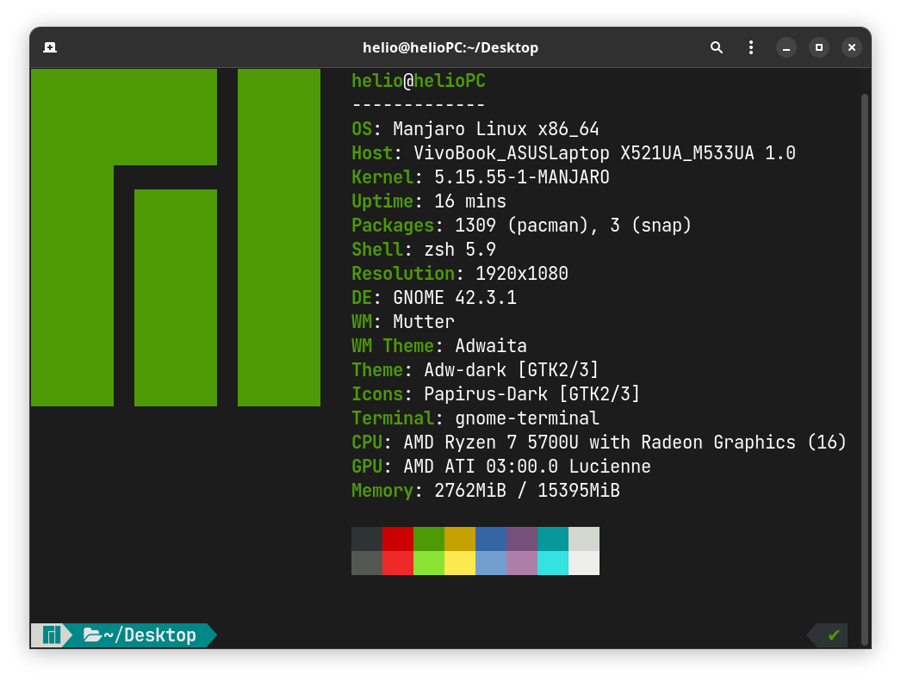

# .dotfiles for Manjaro-linux on Gnome
Manjaro configuraion files

### Description
Installs a number of useful programs, adds shell aliases, keyboard-shortcuts for Gnome.

### Install:
```
$ sh setup.sh
```



